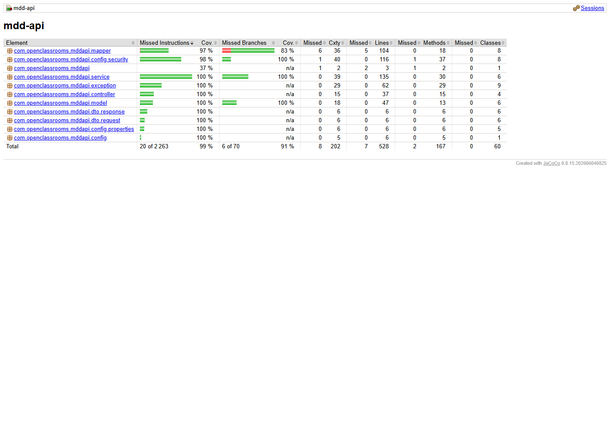
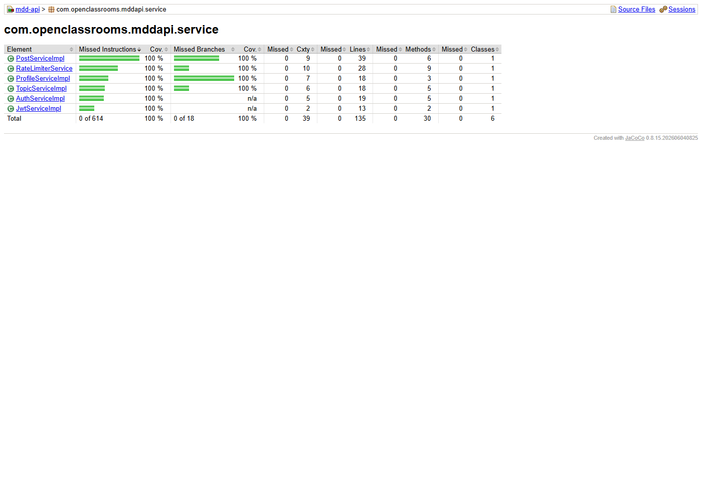

# Tests et couverture

Ce document décrit les types de tests du back-end et présente le rapport de couverture Jacoco généré par `mvn verify`.

## Types de tests

- **Unitaires** (`src/test/java/.../service`, `mapper`, `config`, `exception`...) : services, mappers, configuration de sécurité (JWT, filtres CSRF), rate limiting, gestion centralisée des erreurs. Exécutés par Surefire en phase `test`, sans base de données (dépendances mockées avec Mockito).
- **`@WebMvcTest`** (`controller`) : couche contrôleur testée avec un contexte Spring restreint (mock des services), pour valider le mapping des routes, la sérialisation JSON et les codes HTTP.
- **Intégration** (`src/test/java/.../integration/*IT.java`) : contexte Spring complet (datasource, JPA, Flyway), parcours bout-en-bout contre une vraie base MySQL, sans mock des services — dont le smoke test `MddApiApplicationIT`. Exécutés par Failsafe en phases `integration-test`/`verify`, nécessitent la base `db` démarrée (voir `../README.md` à la racine du repo pour la procédure Docker Compose).

`mvn test` seul n'exécute que les tests unitaires et `@WebMvcTest` (fonctionne hors ligne, sans base). `mvn verify` ajoute la suite d'intégration.

## Couverture Jacoco

Le plugin `jacoco-maven-plugin` (configuré dans `pom.xml`) instrumente l'exécution (`prepare-agent`) et applique un seuil minimum de **80%** sur INSTRUCTION, BRANCH, LINE, COMPLEXITY, METHOD et CLASS, vérifié en phase `verify` (`jacoco-check`, échoue le build si un seuil n'est pas atteint).

Le rapport HTML (`report`, phase `test`) est généré juste après les tests unitaires/`@WebMvcTest`, donc **avant** l'exécution de la suite d'intégration — les captures ci-dessous reflètent la couverture des tests unitaires seule. Le contrôle de seuil (`jacoco-check`, phase `verify`) s'exécute lui après la suite d'intégration et porte donc sur la couverture cumulée (unitaire + intégration), qui est supérieure à ce que montre le rapport visuel.

### Vue d'ensemble



Sur ce run : **99% de couverture d'instructions** (2 243/2 263) et **91% de couverture de branches** (64/70) sur l'ensemble du projet. Tous les modules dépassent 97% de couverture d'instructions ; `mapper` (83%) et `config` (37% pour la classe principale, hors sous-package `security`) restent les points les moins couverts, la classe `MddApiApplication` n'étant testée qu'indirectement par le smoke test d'intégration.

### Détail — package `service`



Le package `service` (règles métier : posts, topics, profil, authentification, rate limiting) est couvert à **100%** en instructions et en branches par les tests unitaires seuls.

## Reproduire ces rapports

```bash
# depuis back/, avec docker compose --env-file src/main/resources/.env.test.properties up -d --build db api
# puis (variables DB_* / RSA_*/ DOMAINS / TOKEN_EXPIRATION chargées depuis .env.test.properties) :
./mvnw verify
# rapport HTML : target/site/jacoco/index.html
```
