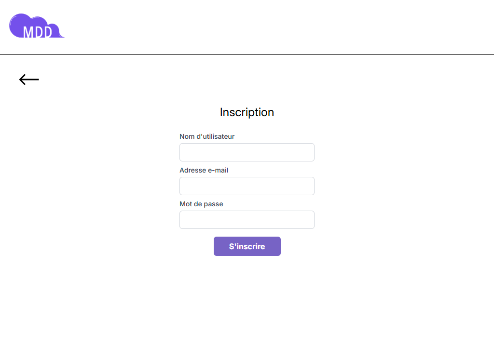
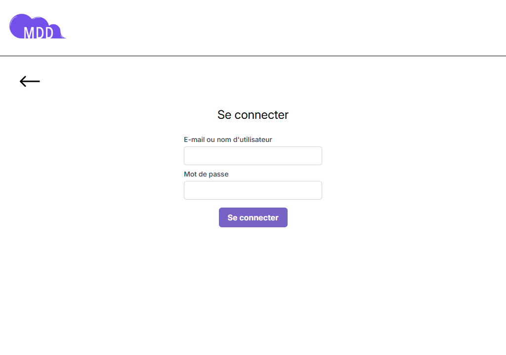
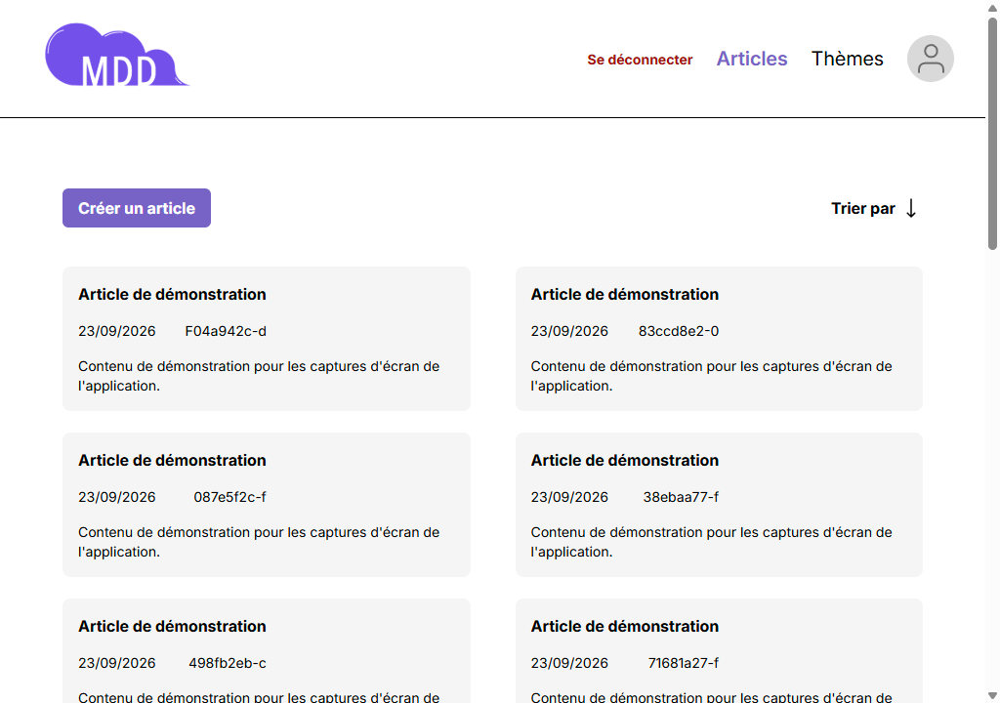
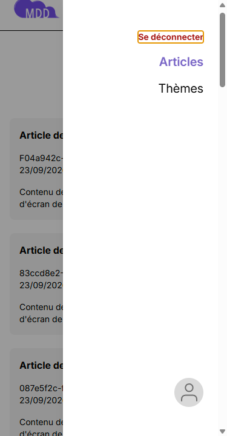
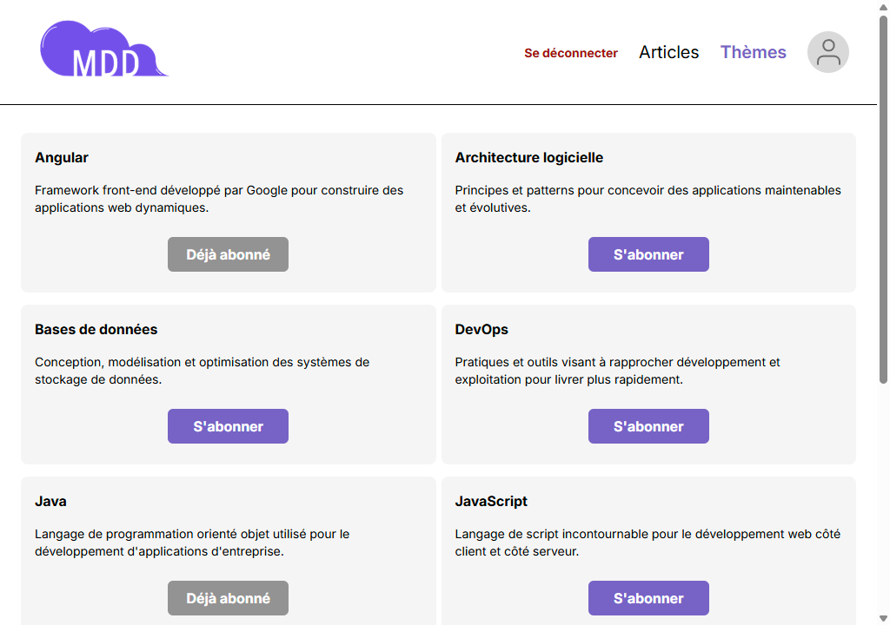
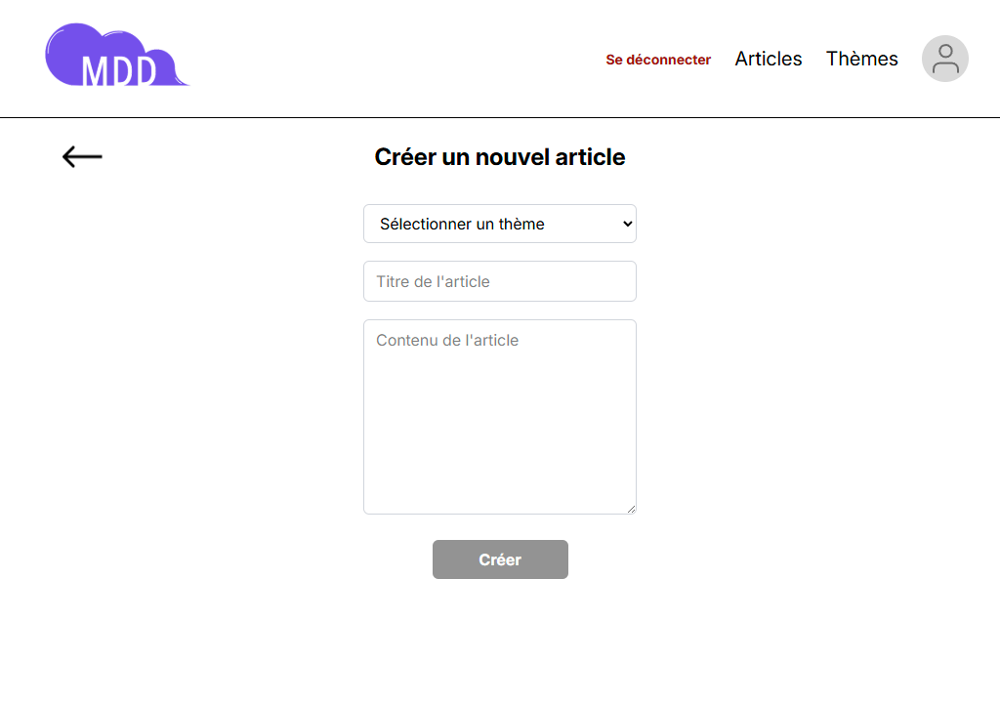
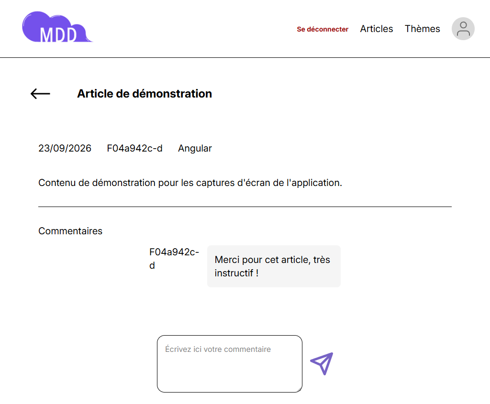
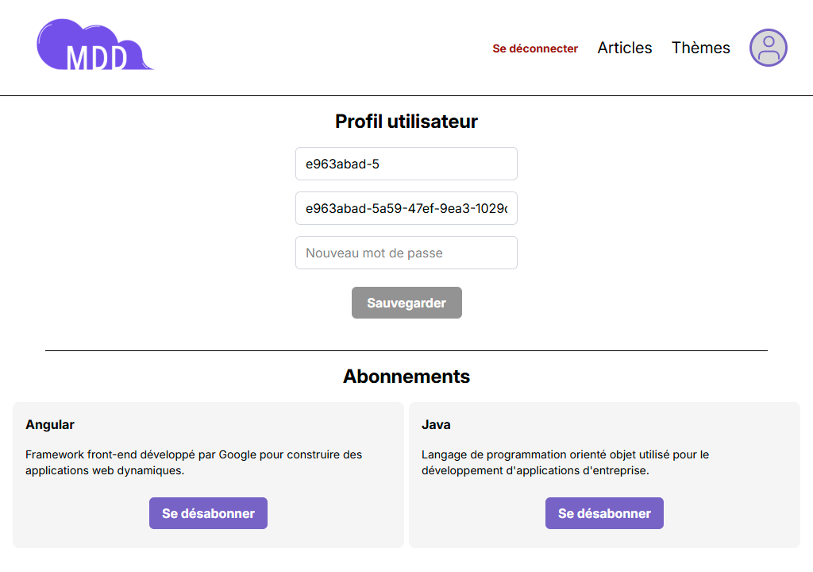
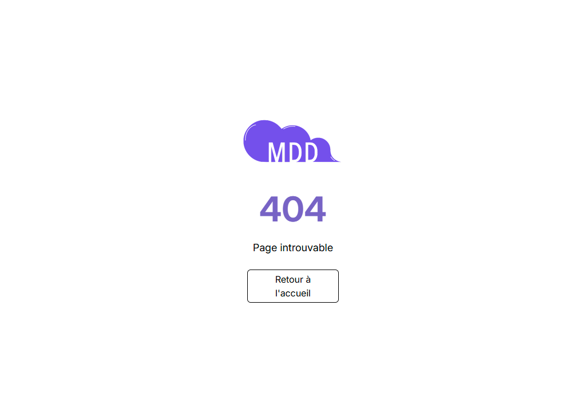

# Analyse des besoins frontend

Ce document relie, pour l'ensemble du projet, chaque besoin fonctionnel du frontend à son (ses) endpoint(s) API, à l'écran Angular qui l'implémente et à la (aux) capture(s) d'écran qui l'illustre(nt) dans [`front/screenshots/`](../screenshots/). Il s'appuie sur :

- la [FAQ utilisateur](faq.md), qui décrit les flux de succès et d'échec côté utilisateur ;
- la [documentation des endpoints](../../back/documentation/endpoints.md) du backend ;
- la structure du code sous `front/src/app/features/` ;
- les captures d'écran présentes dans `front/screenshots/` (une par fonctionnalité, en `desktop.png` et `mobile.png`).

L'objectif est d'avoir une vue d'ensemble vérifiable des besoins couverts, et de faire ressortir les lacunes (captures manquantes, incohérences de documentation) restant à traiter.

## 1. Tableau de synthèse

| Fonctionnalité | Endpoint(s) API | Écran Angular | Captures | Statut |
|---|---|---|---|---|
| Inscription | `POST /auth/register` | `features/auth` (register) | [desktop](../screenshots/register/desktop.png) · [mobile](../screenshots/register/mobile.png) | Couvert (succès) — pas de capture d'état d'erreur |
| Connexion | `POST /auth/login` | `features/auth` (login) | [desktop](../screenshots/login/desktop.png) · [mobile](../screenshots/login/mobile.png) | Couvert (succès) — pas de capture d'état d'erreur |
| Déconnexion / session expirée | `POST /auth/logout` | `core/guards`, `core/services/session-service` (redirection globale, pas de page dédiée) | Aucune | Fonctionnel côté code (guard + service + test e2e `session.cy.ts`), non illustré |
| Fil d'actualité | `GET /posts` (curseur) | `features/feed` | [desktop](../screenshots/feed/desktop.png) · [mobile](../screenshots/feed/mobile.png) · [menu mobile ouvert](../screenshots/feed/mobile-menu-ouvert.png) | Couvert |
| Thèmes (liste + abonnement) | `GET /topics`, `POST /topics/subscribe` | `features/topic` | [desktop](../screenshots/topics/desktop.png) · [mobile](../screenshots/topics/mobile.png) | Couvert (succès) — pas de capture d'état d'erreur |
| Désabonnement à un thème | `DELETE /topics/{id}/subscribe` | `features/profile` (liste des abonnements) | [desktop](../screenshots/profile/desktop.png) · [mobile](../screenshots/profile/mobile.png) | Couvert par la capture profil, pas d'état dédié |
| Création d'article | `POST /posts` | `features/post` (create) | [desktop](../screenshots/post-creation/desktop.png) · [mobile](../screenshots/post-creation/mobile.png) | Couvert (succès) — pas de capture d'état d'erreur |
| Détail d'article + commentaires | `GET /posts/{id}`, `POST /posts/{id}/comments` | `features/post` (detail) | [desktop](../screenshots/post-detail/desktop.png) · [mobile](../screenshots/post-detail/mobile.png) | Couvert (succès) — pas de capture d'état d'erreur |
| Profil (consultation + édition) | `GET /profile`, `PATCH /profile` | `features/profile` (+ `confirm-password-modal`) | [desktop](../screenshots/profile/desktop.png) · [mobile](../screenshots/profile/mobile.png) | Couvert (succès) — pas de capture d'état d'erreur ni de la modale de confirmation |
| Page introuvable (404) | — (routage client) | `features/error` (not-found-page) | [desktop](../screenshots/not-found/desktop.png) · [mobile](../screenshots/not-found/mobile.png) | Couvert par capture, mais sans test e2e dédié |
| Accueil (landing) | — (page statique) | `features/home` | [desktop](../screenshots/home/desktop.png) · [mobile](../screenshots/home/mobile.png) | Couvert |

## 2. Détail par fonctionnalité

### Inscription
- **Besoin** : créer un compte (nom, email, mot de passe) depuis `/register` ([FAQ §1](faq.md#1-inscription)).
- **API** : `POST /auth/register` — pose un cookie `access_token` HttpOnly.
- **Écran** : `features/auth` (page register), validée par `register.cy.ts`.
- **Capture** : 
- **Erreurs FAQ non capturées visuellement** : champs requis, email invalide, règles de complexité du mot de passe, conflit (email/nom déjà pris — `409`).

### Connexion
- **Besoin** : se connecter depuis `/login` avec email/nom + mot de passe ([FAQ §2](faq.md#2-connexion)).
- **API** : `POST /auth/login`.
- **Écran** : `features/auth` (page login), validée par `login.cy.ts`.
- **Capture** : 
- **Erreurs FAQ non capturées** : identifiants invalides (`401`), champs requis, `429` (trop de tentatives).

### Déconnexion et session expirée
- **Besoin** : déconnexion volontaire (bouton menu) ou automatique si la session n'est plus valide ([FAQ §3](faq.md#3-déconnexion-et-session-expirée)).
- **API** : `POST /auth/logout` ; expiration détectée côté client via l'intercepteur HTTP (`core/interceptors`) et le `session-service`.
- **Écran** : pas de page dédiée — redirection transverse gérée par `core/guards/auth-guard` et `session-service`.
- **Test** : `session.cy.ts`.
- **Capture** : aucune

### Fil d'actualité
- **Besoin** : voir les articles des thèmes suivis, avec pagination ([FAQ contexte](faq.md)).
- **API** : `GET /posts?cursor=&direction=`.
- **Écran** : `features/feed`, avec défilement infini (`shared/directives/infinite-scroll`), validé par `feed.cy.ts`.
- **Captures** :  · état menu mobile ouvert : 

### Thèmes — abonnement / désabonnement
- **Besoin** : consulter la liste des thèmes et s'y abonner depuis `/topics` ; se désabonner depuis `/profile` ([FAQ §5](faq.md#5-sabonner-à-un-thème) et [§6](faq.md#6-se-désabonner-dun-thème)).
- **API** : `GET /topics`, `POST /topics/subscribe`, `DELETE /topics/{id}/subscribe`.
- **Écran** : `features/topic` (liste + abonnement), `features/profile` (désabonnement), validés par `topics.cy.ts` et `profile.cy.ts`.
- **Capture** : 
- **Erreurs FAQ non capturées** : thème inexistant (`404`), désabonnement d'un thème déjà quitté.

### Création d'article
- **Besoin** : publier un article (titre, contenu, thème) depuis `/post` ([FAQ §7](faq.md#7-créer-un-article)).
- **API** : `POST /posts` (403 si non abonné au thème).
- **Écran** : `features/post` (create), validée par `create-post.cy.ts` et documentée en détail dans [tests.md](tests.md).
- **Capture** : 
- **Erreurs FAQ non capturées** : champs requis/trop longs, thème invalide.

### Détail d'article et commentaires
- **Besoin** : lire un article et y ajouter un commentaire depuis `/post/:id` ([FAQ §8](faq.md#8-consulter-un-article-et-commenter)).
- **API** : `GET /posts/{id}`, `POST /posts/{id}/comments`.
- **Écran** : `features/post` (detail), validée par `detail-post.cy.ts`.
- **Capture** : 
- **Erreurs FAQ non capturées** : commentaire vide, article introuvable (403/404).

### Profil
- **Besoin** : consulter et modifier son nom/email/mot de passe, confirmé par le mot de passe actuel ([FAQ §4](faq.md#4-modifier-son-profil)).
- **API** : `GET /profile`, `PATCH /profile`.
- **Écran** : `features/profile` + `confirm-password-modal`, validée par `profile.cy.ts`.
- **Capture** :  — la modale de confirmation n'est pas capturée séparément.
- **Erreurs FAQ non capturées** : mot de passe actuel incorrect/requis, champs requis, email invalide, conflit.

### Page introuvable (404)
- **Besoin** : afficher une page dédiée pour toute URL non reconnue ([FAQ §9](faq.md#9-erreurs-générales)).
- **Écran** : `features/error` (not-found-page).
- **Capture** : 
- **Lacune** : aucun test e2e Cypress dédié (absent de la liste `front/cypress/e2e/`).

