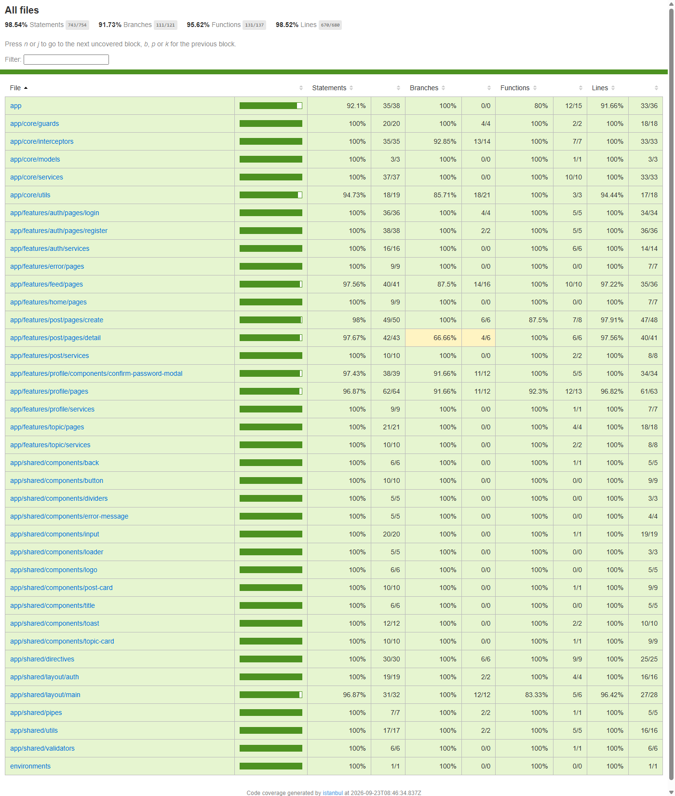
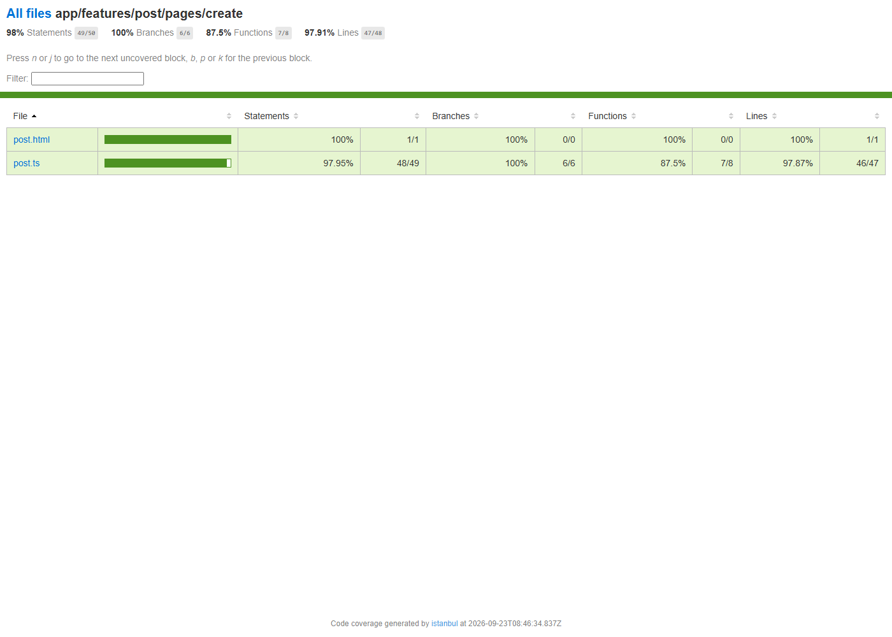
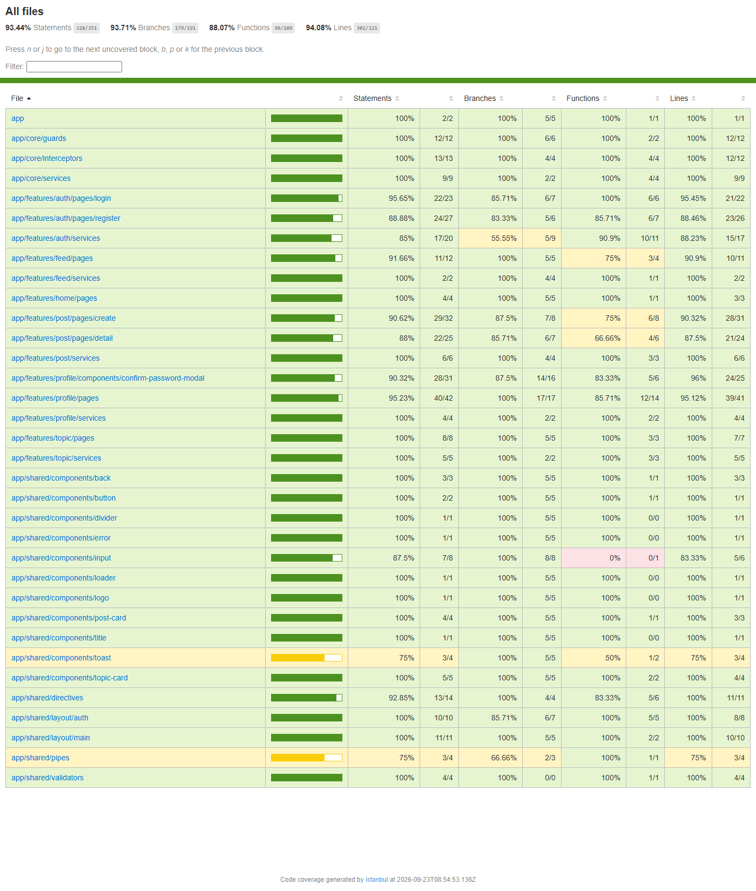

# Tests et couverture

Ce document décrit les tests du front-end (unitaires Jest, e2e Cypress) et présente les rapports de couverture correspondants.

## Tests unitaires (Jest)

Configuration : `jest.config.js`, seuils de couverture à 80% (branches/fonctions/lignes/statements) définis dans `.nycrc.json`/`nycrc.json`. Chaque composant, service, guard, intercepteur, pipe et directive a sa suite `*.spec.ts` associée.

```bash
npm run test:coverage
```

322 tests (43 suites), tous passants. Rapport HTML généré dans `coverage/lcov-report/index.html`.

### Vue d'ensemble



**98.54% de couverture de statements** (743/754), **91.73% de branches** (111/121), **95.62% de fonctions** (131/137), **98.52% de lignes** (670/680). La quasi-totalité des modules `core` et `shared` sont à 100%, les quelques branches non couvertes se concentrent sur les pages `feed`, `post/pages/detail` et `profile/pages`.

### Détail — page de création de post



## Tests end-to-end (Cypress)

Suites dans `cypress/e2e/*.cy.ts` (login, register, session, home, feed, topics, création/détail de post, profil), exécutées contre l'application servie en mode `test` (`environment.test.ts`, API attendue sur `http://localhost:9001/api/v1` — voir `../README.md` à la racine du repo pour démarrer le back en mode test via Docker Compose).

La couverture e2e est mesurée par instrumentation du bundle avec `nyc` (`@cypress/code-coverage`, `.nycrc.json`) :

```bash
npm run e2e:coverage
```

Ce script build l'app en configuration `test`, instrumente le bundle (`nyc instrument`), sert l'app, lance `cypress run`, puis génère le rapport `nyc` (reporter `lcov`, HTML dans `coverage/lcov-report/index.html` — écrase le rapport Jest précédent, d'où l'ordre de capture : Jest avant Cypress).

47 tests (9 specs), tous passants.

### Vue d'ensemble



**93.44% de couverture de statements** (328/351), **93.71% de branches** (179/191), **88.07% de fonctions** (96/109), **94.08% de lignes** (302/321), sur le périmètre effectivement traversé par les parcours e2e (moins large que la couverture unitaire, qui teste aussi les cas d'erreur et les branches isolées).
